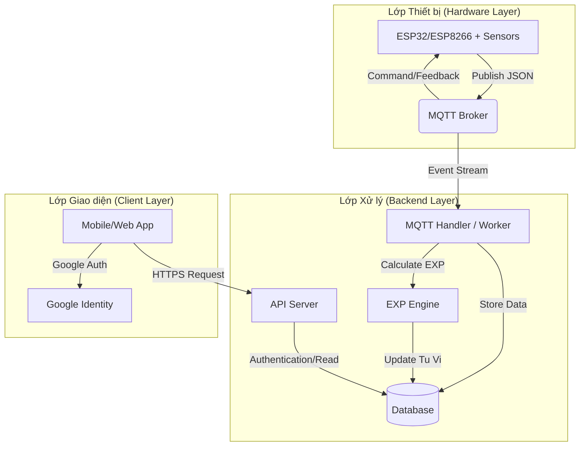
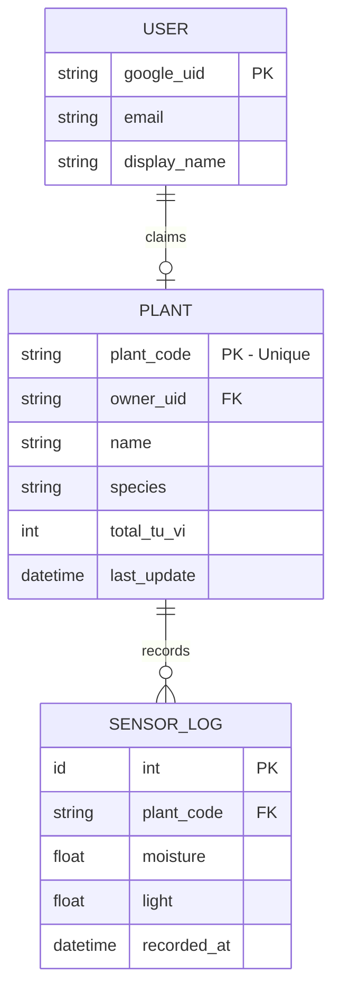

# Kiến trúc Hệ thống (System Architecture) — Mộc Đạo Tu Tiên

## 1. Sơ đồ tổng thể (High-Level Architecture)

Hệ thống được thiết kế theo mô hình **Event-driven** sử dụng MQTT Broker để kết nối thiết bị IoT và các Microservices/Backend.

## 2. Các thành phần chính

### 2.1. Lớp Thiết bị (IoT Hub)
*   **Vận hành:** Đọc dữ liệu từ cảm biến độ ẩm đất và ánh sáng mỗi 1 phút.
*   **Giao tiếp:** Kết nối WiFi và đẩy dữ liệu lên Broker qua giao thức MQTT.

### 2.2. Lớp Trung gian (MQTT Broker)
*   **Vai trò:** Trạm trung chuyển dữ liệu. Đảm bảo tính realtime và giảm tải cho API Server.

### 2.3. Lớp Xử lý (Backend Services)
*   **MQTT Handler:** Lắng nghe dữ liệu từ Broker, validate Plant Code và lưu lịch sử cảm biến.
*   **EXP Engine:** "Bộ não" của game. Chứa các quy tắc từ file `exp_system_logic.md` để cộng/trừ Tu Vi cho cây.
*   **API Server:** Xử lý các yêu cầu từ App người dùng (đăng nhập Google, lấy thông tin cây, claim thiết bị).

### 2.4. Lớp Dữ liệu (Database)
Sử dụng mô hình Hybrid (ví dụ: MongoDB để lưu log cảm biến và SQL cho thông tin Plant/User).

## 3. Sơ đồ Cơ sở dữ liệu (Database Schema)

Hệ thống quản lý 3 thực thể chính:

## 4. Luồng dữ liệu tiêu biểu
1.  **Thiết bị** gửi định kỳ {ẩm, sáng} lên Broker.
2.  **Backend** nhận được, lưu vào `SENSOR_LOG`.
3.  **EXP Engine** tính toán dựa trên `SENSOR_LOG` mới nhất, cập nhật `total_tu_vi` trong bảng `PLANT`.
4.  **App người dùng** gọi API để lấy `total_tu_vi` mới nhất và hiển thị cho người dùng.
